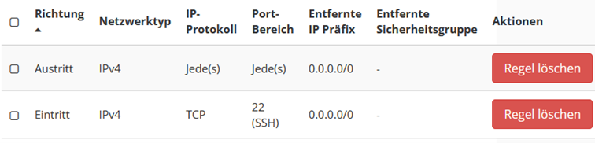
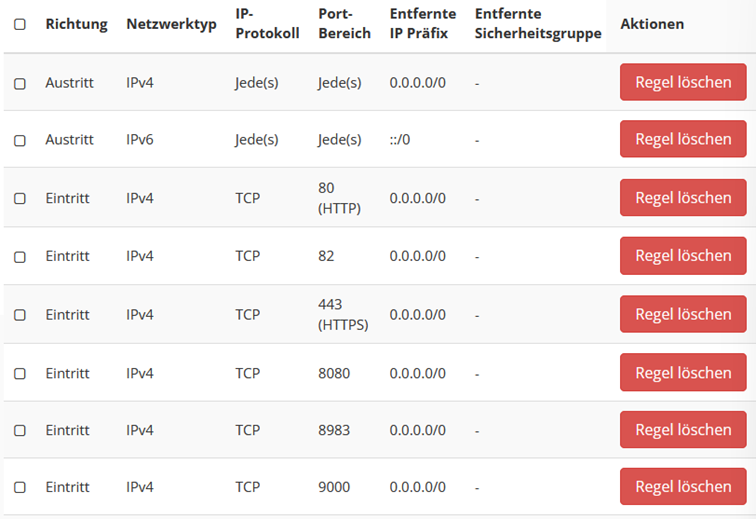

# Technische Dokumentation

## Server Setup

Das BUA-VIVO Projekt nutzt insgesamt 3 Live-Server sowie einen Testserver.

Alle Server befinden sich im HU Open Stack

*   Link: [https://host.hu-berlin.de/auth/login/?next=/](https://host.hu-berlin.de/auth/login/?next=/)
*   Freischaltung durch das [OpenStack Team](mailto:mschmidt@cms.hu-berlin.de)

### Serverdetails

1.  BUA-VIVO
    1.  m1.large
    2.  8 GB RAM
    3.  4 VCPU
    4.  80 GB Festplattenspeicher
2.  SolR
    1.  M1.small
    2.  2 GB RAM
    3.  1 VCPU
    4.  20 GB Festplattenspeicher
3.  Datenverarbeitung
    1.  m1.medium
    2.  4 GB RAM
    3.  2 VCPU
    4.  40 GB Festplattenspeicher

### Serverzugang

Aus dem HU-Netz sind die Server via SSH zu erreichen, nachdem ihnen eine floating IP zugewiesen wurde.

```text
ssh ubuntu@141.20.184.XXX
```

Nachdem Agent-Forwarding aktiviert ist (siehe SSH-Config), können Verbindungen auf Server ohne floating IP hergestellt werden. Wenn WSL benutzt wird muss der SSH-Agent vorher evaluiert werden

Für WSL:

```text
eval $(ssh-agent)
```

Nach Aktivierung des Agent-Forwardings:

```text
Nutzer@DESKTOP:~$ ssh ubuntu@141.20.184.XXX
debian@VIVO-Server:~$ ssh ubuntu@192.168.10.XXX
```

### Server-Installation

Das Grundsetup der Server wird über die Open-Stack Webseite vorgenommen.

Das OS auf allen Servern ist Debian 10.  Spezifikationen siehe oben.

Erste SSH-Regeln via OpenStack setzen.

Floating IPs an den Vivo- und an den DV-Server anhängen

#### Portfreigaben

*   ssh\_group


*   default security group


*   ping\_group


*   apache\_tomcat


*   solr


#### Updates

Das Debian OS auf den OpenStack Servern ist nicht aktuell. Betriebssystem und Programme müssen vor der ersten Benutzung upgedatet werden.

```text
sudo apt update
sudo apt upgrade
sudo apt-get update
sudo apt-get upgrade
```

#### Zusätzliche SSH-Keys und SSH-Config

Der SSH-Ordner liegt im User-Ordner, ist aber ausgeblendet

```text
cd ~/.ssh
```

Zusätzliche SSH-Keys müssen den authorized-keys hinzugefügt werden. Nano ist vorinstalliert und kann zum öffnen der Datei verwendet werden. DIe Keys dann einfach hineinkopieren.

```text
nano ~/.ssh/authorized_keys 
```

In der SSH-Config muss SSH-Forwarding aktiviert werden, um auf Server im Subnetz zugreifen zu können:

```text
nano ~/.ssh/config
```

Dort Folgendes einfügen:

```text
Host 192.168.10.*
    ForwardAgent yes
    AddKeysToAgent yes
```
